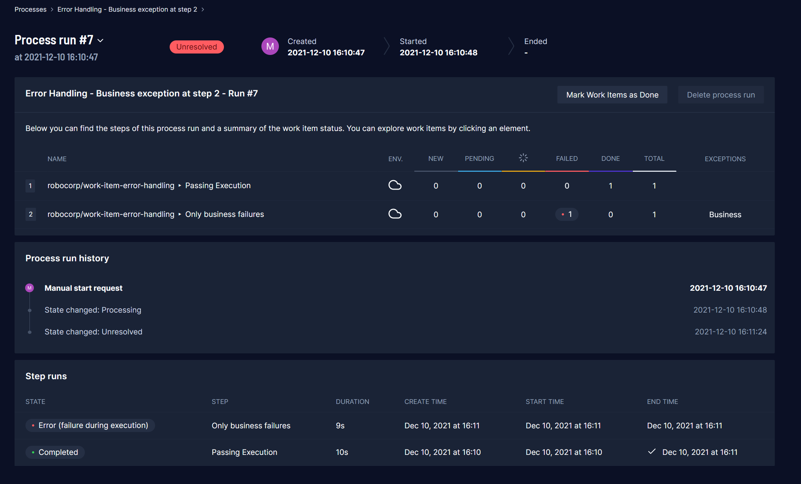
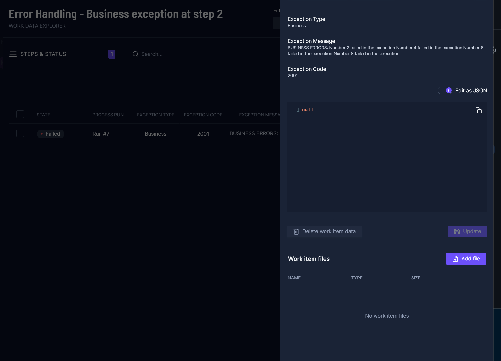
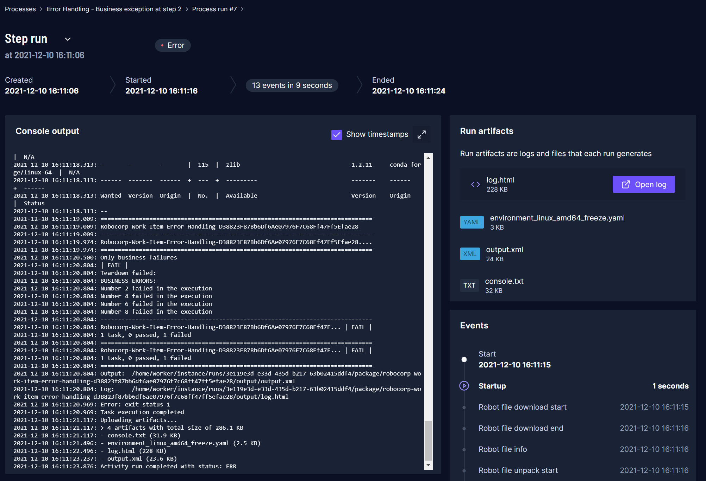
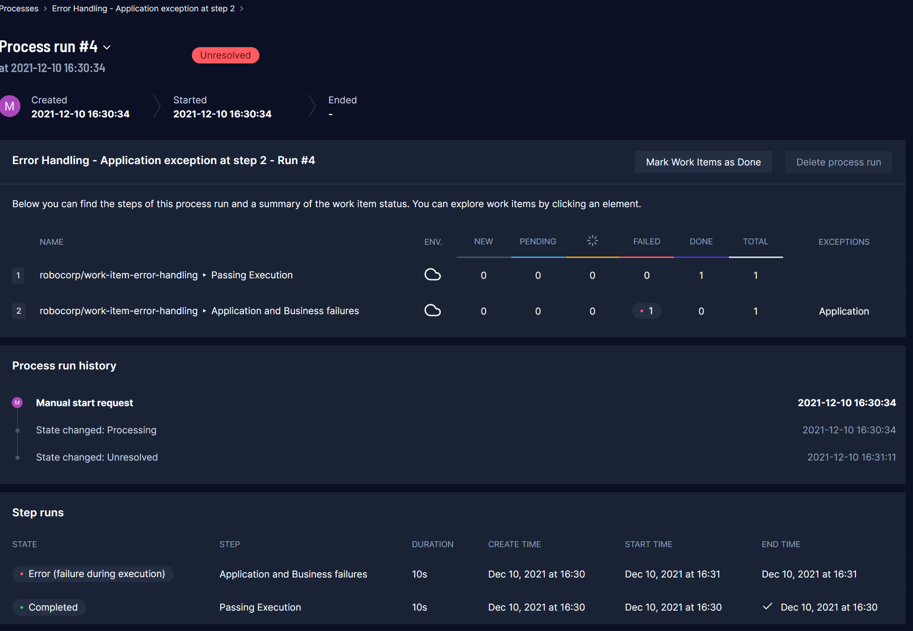
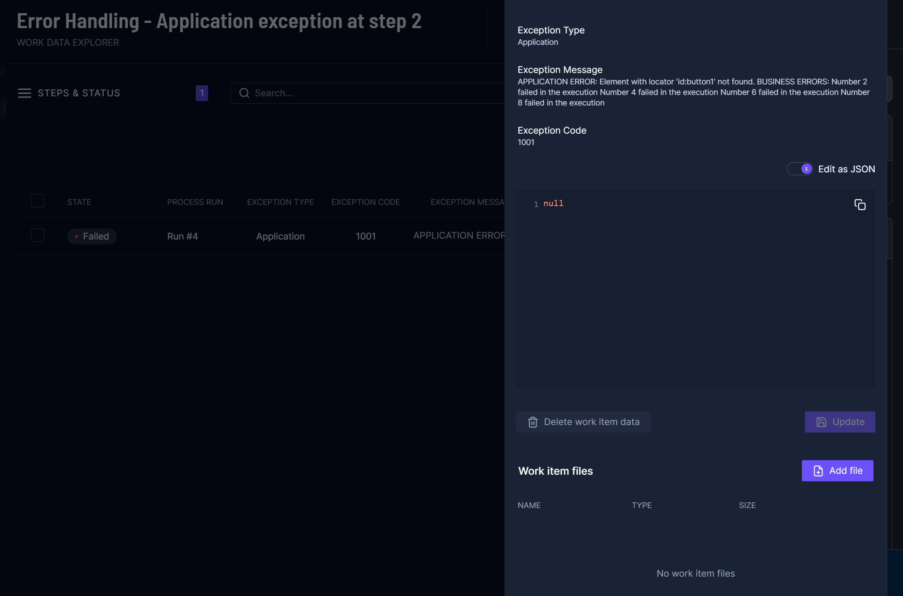
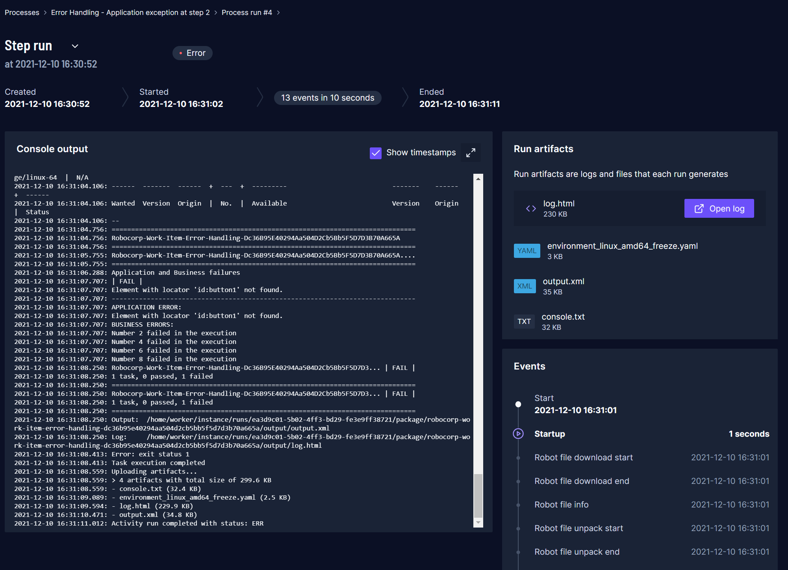

# Work Item Error Handling

Example is based on concept of [Suite Teardown](https://robotframework.org/robotframework/latest/RobotFrameworkUserGuide.html#suite-setup-and-teardown) which is a ``Robot Framework`` execution step which will be executed at the end of Robot execution.

# Table of Contents

- [Robot Overview](https://github.com/robocorp/work-item-error-handling#robot-overview)
- [Task: Passing Execution](https://github.com/robocorp/work-item-error-handling#task-passing-execution)
- [Task: Only Business Failures](https://github.com/robocorp/work-item-error-handling#task-only-business-failures)
- [Task: Application and Business Failures](https://github.com/robocorp/work-item-error-handling#task-application-and-business-failures)
- [Control Room Setup](https://github.com/robocorp/work-item-error-handling#control-room-setup)

## Robot overview

Robot has been divided into three tasks:

    1. Passing Execution
    2. Only business failures
    3. Application and Business failures

All tasks will execute `Suite Teardown` step as described in the overview (above).

### Task: Passing Execution

Does not do anything but will go through error handling.

### Task: Only business failures

Will execute keyword ``User Keyword`` which is run with ``Run Keyword And Ignore Error``.
This will enable checking keyword status and error message specifically to determine how
errors should be handled for that keyword.

In this case error messages are appended to global error messages list, which will be
handled by the ``Suite Teardown`` at the end of the execution. These errors are labeled
with an exception type **Business**.

**Image.** Control Room run overview shows step 2 Business exception

**Image.** Control Room view on exception details

**Image.** Control Room view on run console log

### Task: Application and Business failures

In addition to the ``Only business failures`` task this task will be using ``RPA.Browser.Selenium``
library to cause uncaught exception on ``Click Element`` keyword which will be labeled with an
exception type **Application**. All **Business** exceptions are also appended to the overall error message.

**Image.** Control Room run overview shows step 2 Business exception

**Image.** Control Room view on exception details

**Image.** Control Room view on run console log

## Control room setup

To see how to set up Control Room and understand more about how work items are used, see the following article: [Using work items](https://robocorp.com/docs/development-guide/control-room/data-pipeline).
